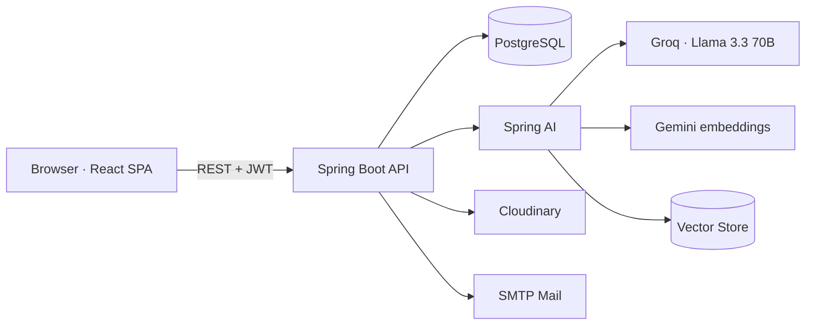

<div align="center">

# HiveMind

**A collaborative document platform for students, powered by AI-driven search, chat, and recommendations.**

[Overview](#overview) · [Features](#features) · [Tech Stack](#tech-stack) · [Architecture](#architecture) · [Getting Started](#getting-started) · [Team](#team)

</div>

---

## Overview

HiveMind is a web platform where students upload, organize, share, and study documents together. On top of a full document-management system, it integrates AI to make knowledge easier to find: semantic search across uploaded material, a chat assistant grounded in the user's own documents, and personalized recommendations.

The project is organized into three functional modules — Authentication & Profile, Document Management, and AI — developed as the SWP391 capstone at **FPT University HCM**.

## Features

**Documents**

- Upload and in-browser preview for PDF, DOCX, and XLSX files
- Organize with favorites, collections, and a trash/restore flow
- Share by email with fine-grained visibility (private / shared / public)
- Report and appeal workflow for community moderation

**AI**

- Semantic search over document content using vector embeddings
- Chat assistant that answers from the user's own documents
- Related-document recommendations

**Accounts & Access**

- Email/password sign-up with validation and email verification
- Google and GitHub OAuth sign-in
- JWT-based authentication with role-based authorization
- Profile management with avatar upload and notifications

**Administration**

- Dashboard with system-wide statistics and storage usage
- Management of users, documents, keywords, subjects, reports, and appeals
- Configurable upload allowlist with content-type enforcement

**Platform**

- Full internationalization (Vietnamese / English)
- Responsive interface built with Tailwind CSS

## Tech Stack

| Layer | Technologies |
|-------|--------------|
| **Frontend** | React 18, Vite, React Router, Tailwind CSS, i18next, Axios, react-pdf, docx-preview |
| **Backend** | Java 21, Spring Boot 3, Spring Security, Spring Data JPA, JWT (jjwt) |
| **AI** | Spring AI — Groq (Llama 3.3 70B) for chat via an OpenAI-compatible client, Google Gemini for embeddings, vector store, PDF/Tika document readers |
| **Database** | PostgreSQL |
| **Storage & Mail** | Cloudinary (file storage), SMTP mail |
| **Build** | Maven (backend), npm + Vite (frontend) |

## Architecture



The React single-page app talks to the Spring Boot API over REST, authenticating with JWT. The backend persists data in PostgreSQL, offloads file storage to Cloudinary, and delegates AI features to Spring AI, which embeds documents into a vector store for semantic search and retrieval-augmented chat.

## Getting Started

### Prerequisites

- Java 21+ and Maven
- Node.js 18+ and npm
- PostgreSQL 16
- Credentials: Google & GitHub OAuth apps, Groq API key (chat), Google Gemini API key (embeddings), Cloudinary account, and SMTP mail

### 1. Clone

```bash
git clone https://github.com/quoc-ty/AISH.git
cd AISH
```

### 2. Backend

Copy the template and fill in your own values (the real `application.properties` is kept out of version control):

```bash
cd backend/src/main/resources
cp application.properties.example application.properties
```

Then edit `application.properties` — set your PostgreSQL credentials, Google/GitHub OAuth client IDs and secrets, Groq and Gemini API keys, Cloudinary account, and Gmail SMTP app password. All keys are documented inline in the example file.

Run the API (defaults to `http://localhost:8080`):

```bash
cd backend
./mvnw spring-boot:run
```

### 3. Frontend

```bash
cd frontend
npm install
npm run dev
```

The app runs at `http://localhost:5173` by default.

## Project Structure

```
AISH/
├── backend/     # Spring Boot API (auth, documents, AI, admin)
├── frontend/    # React + Vite single-page app
└── document/    # Project documentation
```

## Team

Built by four full-stack developers at FPT University HCM. Every member worked across both backend and frontend within their module.

| Member | Module | GitHub |
|--------|--------|--------|
| Nguyễn Thị Anh Như | Module 1 — Authentication, Profile & Notifications | [@LamAnhNhu](https://github.com/LamAnhNhu) |
| Võ Minh Anh | Module 2 — Document Management | [@Vma170524](https://github.com/Vma170524) |
| Trần Vũ Đinh Lăng | Module 2 — Document Management | [@tranvudinhlang2005](https://github.com/tranvudinhlang2005) |
| Nguyễn Quốc Tỷ | Module 3 — AI | [@quoc-ty](https://github.com/quoc-ty) |

## License

Academic project developed for **SWP391** at FPT University HCM. Not licensed for commercial use.
